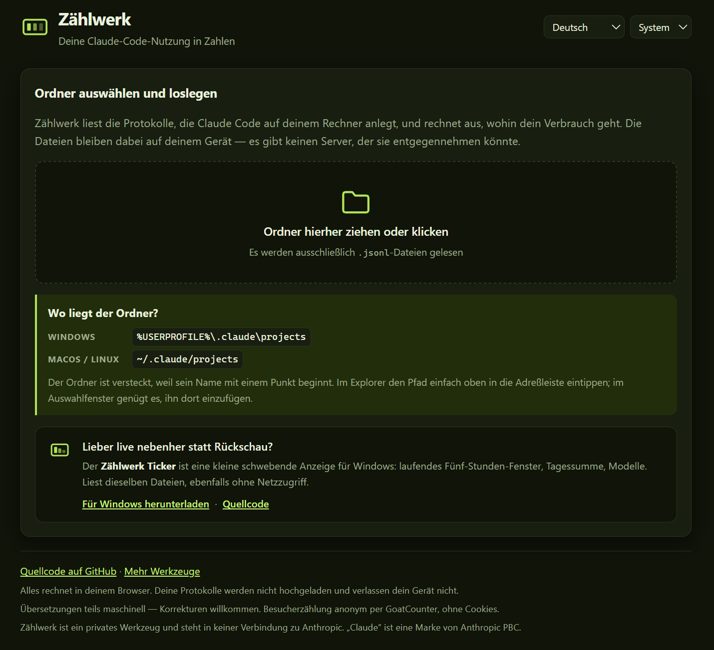

# Zählwerk 📊

**Wohin geht dein Claude-Code-Verbrauch eigentlich?** Ordner auswählen — Zählwerk liest die Protokolle, die Claude Code auf deinem eigenen Rechner anlegt, und schlüsselt die Zahlen auf: nach Tag, Modell, Projekt, Woche und Uhrzeit.

   

**→ [dennismit2n.github.io/zaehlwerk](https://dennismit2n.github.io/zaehlwerk/)** · [English version of this file](README.md)

---

## Was es macht — und was nicht

| | |
|---|---|
| 📊 **Zählt, was wirklich verbraucht wurde** | Eingabe, Ausgabe und neu zwischengespeicherter Kontext, aufsummiert nach Tag, Modell, Arbeitsordner, Git-Zweig, Woche und Tageszeit. |
| 🧮 **Zählt jede Antwort genau einmal** | Eine einzelne Antwort steht mehrfach in den Protokollen — einmal je Block, aus dem sie besteht (Nachdenken, Text, Werkzeugaufruf), und *jede* dieser Zeilen trägt die vollständige Abrechnung. Wer sie naiv zusammenzählt, verdoppelt ungefähr jede Zahl. Zählwerk entdoppelt über `message.id`. |
| 🔍 **Trennt den erneut gelesenen Kontext ab** | Rund 96 % aller gezählten Token sind Gesprächsverlauf, der bei jeder Folgefrage nochmals mitgezählt wird. Diese Zahl wächst mit der Länge einer Sitzung, nicht mit deiner Arbeit — deshalb steht sie **neben** der Summe und niemals darin. |
| 🚫 **Keine Prozentanzeige deines Limits** | Wie viel Kontingent dir noch bleibt, steht in diesen Dateien nicht. Zählwerk kann nur zählen, was verbraucht wurde. |
| 🚫 **Keine Kostenangabe** | In den Protokollen stehen keine Preise, und im Abonnement kostet Claude Code nichts zusätzlich. Ein Betrag wäre erfunden. |
| 🚫 **Nur Claude Code** | Was du auf claude.ai im Browser tust, hinterlässt keine Protokolle auf der Festplatte und taucht deshalb hier nicht auf. |

## Loslegen

1. **[Werkzeug öffnen](https://dennismit2n.github.io/zaehlwerk/)**
2. Ordner auswählen — unter Windows `%USERPROFILE%\.claude\projects`, sonst `~/.claude/projects`. Er ist versteckt: den Pfad einfach oben in die Adreßzeile des Auswahlfensters eintippen.
3. Fertig. Jeder Bereich hat ein **?**, das erklärt, wie er zu lesen ist.

## Datenschutz

Deine Protokolle werden **gelesen, nicht gesendet**. Es gibt keinen Server, der sie entgegennehmen könnte: Die Seite ist statisch, die Auswertung läuft vollständig in deinem Browser.

Das mußt du nicht glauben — es ist nachprüfbar:

- Ein `grep` über den Quellcode nach `fetch`, `XMLHttpRequest`, `WebSocket` und `navigator.sendBeacon` findet in `js/app.js` und `js/auswertung.js` **null** Treffer
- Es gibt keine externen Skripte, kein CDN, keine nachgeladene Schrift
- Entwicklerwerkzeuge öffnen, Netzwerk-Reiter beobachten, Ordner hineinziehen: außer der Seite selbst und dem Besucherzähler geht nichts hinaus

Eines solltest du wissen: In diesen Protokolldateien steht **jedes Wort jedes Gesprächs**. Zählwerk liest davon nur die Abrechnungszeilen und zeigt niemals Gesprächsinhalte an — aber die Dateien sind heikel, und das gehört gesagt, bevor man sie irgendeinem Werkzeug übergibt, auch diesem.

Die Besucherzählung läuft über **GoatCounter** — anonym, ohne Cookies, `count.js` liegt in diesem Repository. Das ist die eine Anfrage, die hinausgeht, und sie trägt nichts über deine Dateien mit sich.

## Unter der Haube

Statische Seite, kein Build-Schritt, keine Abhängigkeiten.

| Datei | Zeilen | Zweck |
|---|---:|---|
| `js/auswertung.js` | 321 | die Rechnerei — läuft im Browser und unter Node, damit sie gegen echte Dateien prüfbar ist |
| `js/app.js` | 499 | Dateien einlesen, Fortschritt, alle Ansichten zeichnen |
| `js/i18n.js` | 1177 | 14 Sprachen à 90 Schlüssel, mehr wo die Sprache eigene Mehrzahlformen braucht |
| `css/style.css` | 369 | hell und dunkel, je ein Variablensatz |
| `index.html` | 282 | Aufbau mit `data-i18n`-Haken |

Mengenangaben laufen über `Intl.PluralRules`, Zahlen und Prozente über `Intl.NumberFormat` — so bekommt Russisch `1 ответ / 2 ответа / 5 ответов` und `1 500`, während Deutsch `1 Antwort / 2 Antworten` und `1.500` bekommt.

**Das Protokollformat ist von Anthropic nicht dokumentiert.** Ändert es sich, zeigt dieses Werkzeug zu wenig an oder gar nichts mehr. Das ist der Preis dafür, Dateien zu lesen, für deren Beständigkeit niemand garantiert hat.

## Sprachen

Deutsch · English · Español · Français · Italiano · Nederlands · Polski · Português · Türkçe · Русский · हिन्दी · 中文 · 日本語 · 한국어

Ein Teil der Übersetzungen ist maschinell entstanden. Korrekturen sind sehr willkommen — gern als Issue oder Pull Request.

## Lizenz

MIT — siehe [LICENSE](LICENSE). Nutzen, lesen, forken, verbessern.

---

Zählwerk ist ein privates Werkzeug und steht **in keiner Verbindung zu Anthropic**. „Claude" ist eine Marke von Anthropic PBC.

Teil der [Werkstatt](https://dennismit2n.github.io/) von Dennis_mit_2n.
